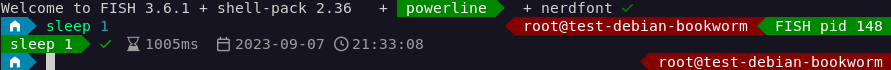

# shell-pack
A fish shell environment with many quality of life improvements for sysadmins and devops.



tl;dr see [the docs](docs/index.md) on [how to install shell-pack](docs/installation.md).

## Features
 * vibrant colors, nice icons
 * execution time, exit status and pipe status visibility
 * background job execution time, exit status, PID visibility
 * a cheat sheet for itself, ```cheat```, and a test for your terminal, ```cheat --glyphs```
 * advanced directory navigation
   * `shift-arrows` or `alt-arrows` navigate history back, forward, dir up and dive with menu
   * `alt-d` or alias `d` jumps to bookmarks set with `tagdir`, `untagdir`
   * `alt-c` shows recursive change directory menu
 * improved `ctrl-r` history navigation and deletion
 * private mode alias `private`
 * recursive search for filenames with `alt-f`
 * tab / window title control with ```tag```, ```untag```, informative generated titles
 * tmux shortcuts, including exclusive session ```one``` for shared access

## Custom tools
 * `dl`: download URL with either curl or wget as backend
 * `cfc`: compressed file creation, shortcut for tar, 7z, zstd, etc.
 * `cfd`: compressed file decompression
 * `qssh`: a frontend to ssh with enhanced fingerprint dialogue, multi connect and more (requires ssh)
 * `rrg` (`alt-g`): an easy to use ripgrep file content search with preview
 * `ggit`: quickly review changes, add files to the commit
 * `venv`: activate / deactivate Python virtual env corresponding to current directory
 * `zero-unused-space`: fill 90% of free space with null-bytes
 * `create`, create and edit boilerplate files of various types
 * `qcrypt`, encrypt file or stream with password utilizing `openssl` or `gpg`
 * Linux only
   * `lsports`: list open ports in compact manner
   * `lsnet`: list active network connections in compact manner
   * `ddool`: a dool wrapper with "sticky" arguments
   * `qmount`: mount a partition to /run/q/name (blockdevice autocomplete)
   * `ssmart`: shortcut to smartctl -x (skip /dev/)
   * `qchroot`: enter a Linux chroot, mounting all the necessities of modern Linux life
   * `qqemu`: start a disk or partition in a temporary VM without modifying the disk or network connectivity
   * `@`: ad-hoc ```atd``` replacement for executing commands at a given time as if typed into the prompt

## Bundled tools
On first startup, these tools will be downloaded and installed into a dedicated directory if not readily available
on the system. Each tool will be presented and permission
for download will be asked for:
 * [rg](https://github.com/BurntSushi/ripgrep) (ripgrep)
 * [fzf](https://github.com/junegunn/fzf) (fuzzy finder)
 * [dool](https://github.com/scottchiefbaker/dool) (dstat replacement)

## Bundled shell integrations
Some terminals propagate custom shell integration scripts to enable advanced
features like gathering what output belongs to which submitted command or
marking prompts in their scroll history.

Included are:
 * [iterm2](https://github.com/gnachman/iTerm2/blob/master/Resources/shell_integration/iterm2_shell_integration.fish) (enabled by default, provides OSC 133 and OSC 1337 sequences)
 * [vscode](https://github.com/microsoft/vscode/blob/main/src/vs/workbench/contrib/terminal/common/scripts/shellIntegration.fish) (enabled when `vscode` is `$TERM_PROGRAM`, provides OSC 633 sequences)
