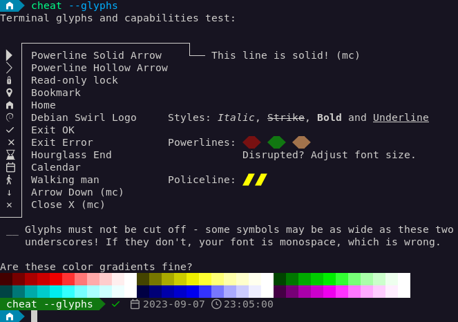

# Setting up gnome-terminal

## Nerd Font

 * Download your preferred Nerd Font from www.nerdfonts.com, for example [DejaVuSansMono](https://github.com/ryanoasis/nerd-fonts/releases/download/v2.1.0/DejaVuSansMono.zip)
 * Place all \*.ttf files from the .zip file not named "Windows Compatible" in ~/.local/share/fonts/

## Gnome Terminal
 * Shift + Right-click > Preferences
 * In section "General"
  * Uncheck "Enable the menu accelerator key (F10)", because f10 is to exit mc
  * Set theme to a dark theme, because light themes for terminals are wrong
 * Add a new profile (+)
  * On tab "Text", check custom font, select "DejaVuSansMono Nerd Font Mono", 11 point looks best (more on that later)
  * On tab "Command", check "Run a custom command", enter this:
```
/usr/bin/env LC_NERDLEVEL=3 fish -l
```
  * Optionally make it default (click on triangle)

### Fix the font in dconf
Since the picker will allow selecting monospaced fonts only, our initial pick was technically wrong. If you open a terminal now and run `cheat --glyphs`, you will see the policeline glyphs are cut half and spaced weird.

The fix is to edit the settings manually and set the font to "DejaVuSansMono Nerd Font" - note how it has one "mono" less in the name.

 * Dump the dconf and edit the file
```
dconf dump /org/gnome/terminal/ > ~/gnome-terminal.dconf
edit ~/gnome-terminal.dconf
```
 * Spot the font setting, remove the "Mono" at the end
```
font='DejaVuSansMono Nerd Font 11'
```
* Import the dump
```
dconf load /org/gnome/terminal/ < ~/gnome-terminal.dconf
```
## The result


## Further reading
 * [LC_NERDLEVEL](introducing-nerdlevel.md)
 * [Preferences](preferences.md)
 * [Return to index](index.md)
