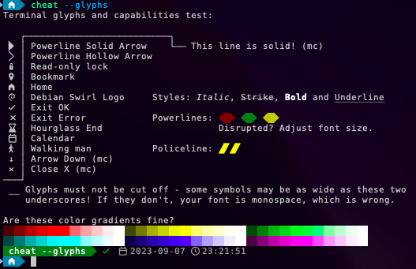

# Setting up iTerm2

## Nerd Font
* Download your preferred Nerd Font from www.nerdfonts.com, for example [DejaVuSansM](https://github.com/ryanoasis/nerd-fonts/releases/download/v3.0.2/DejaVuSansMono.zip)
* Install the font on your system, skipping all files named "Propo" or "Mono"

## iTerm2

 * In "Preferences", navigate to "Profiles" and create a new profile
 * On profile tab "General", set command to:
```
/usr/bin/env LC_NERDLEVEL=3 /usr/local/bin/fish -l
```
 * On profile tab "Text", set font to the installed Nerd Font
 * On profile tab "Keys", set left option key to Esc+
 
 Note the iTerm2 fish integration script is included in shell-pack and automatically applied when iTerm2 is used.

## The result

 
## Further reading
 * [LC_NERDLEVEL](introducing-nerdlevel.md)
 * [Preferences](preferences.md)
 * [Return to index](index.md)
